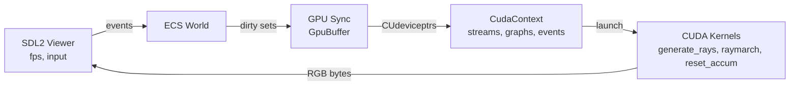

I’ve been building a compact real-time renderer from scratch as a personnal project.

  

## TLDR

* Host: Rust + low-level `cuda-driver-sys`.
* Device: custom CUDA kernels with CUDA Graphs.
* Engine: lightweight ECS with dirty-bit sync to GPU buffers.
* Geometry: SDF primitives and binary CSG trees.
* Textures: host caching, device upload, spherical + triplanar mapping.
* Viewer: SDL2 texture, FPS overlay, live input.

---
## Overview

A **real-time ray marching engine** built using:
- **Rust** on the host for safety and performance.
- **CUDA** on the device for parallel rendering.
- **ECS (Entity-Component-System)** for dynamic scene management.
- **SDL2** for real-time display and input.

The goal: a lightweight, modular, and fully GPU-accelerated renderer capable of rendering procedural SDF (Signed Distance Function) scenes with **CSG (Constructive Solid Geometry)**, **textures**, and **space folding** in real time.

**More precisely**

The renderer runs entirely from Rust, communicating with CUDA through a lightweight host layer that manages contexts, kernels, and memory transfers directly. Frame execution relies on pre-recorded GPU graphs that can update their parameters between frames without rebuilds, keeping latency predictable even as scenes grow.

The engine’s world state lives in a compact ECS, where each component set mirrors to the GPU only when changed. GPU buffers expand dynamically and migrate data device-to-device to avoid stalls. Scene composition uses a CSG tree compiled into tightly packed GPU arrays, which the kernels evaluate directly during ray marching.

Textures and materials stream from the host with automatic lifetime tracking, supporting both spherical and triplanar mapping. Folding transforms allow repeating patterns through invertible lattice bases. Each frame combines analytic distance fields, simple lighting, and asynchronous copy-back to the SDL2 viewer, sustaining real-time feedback while keeping the architecture minimal and explicit.

---

## Architecture

---

## Project layout

* `src/cuda_wrapper.rs` — CUDA context, graphs, streams, pinned memory, events, `GpuBuffer<T>`.
* `src/ecs.rs` (+ submodules) — ECS world, components, systems, GPU sync, index maps.
* `src/display.rs` — SDL2 window, streaming texture, FPS overlay, event pump.
* `src/scene.rs` — scene builders (basis gizmo, CSG demos).
* `src/gpu_utils/kernel.cu` — kernels and GPU data mirrors.
* `src/main.rs` — wiring and main loop.

---

## CUDA host wrapper (`src/cuda_wrapper.rs`)

**Highlights**

* `CudaContext::new(ptx)` loads PTX and creates the driver context.
* `load_kernel`, `create_stream`, `launch_kernel`, `synchronize_stream`.
* Graph API:

  * `create_cuda_graph`, `add_graph_kernel_node`, `add_dependency`.
  * `instantiate_graph`, `launch_graph`.
  * `exec_kernel_node_set_params` patches only the `kernelParams` pointer array. Grid and block stay intact.
* Pinned host memory and events:

  * `alloc_pinned`, `memcpy_dtoh_async`, `create_event`, `event_record_on`, `event_synchronize`.
  * `launch_and_stage_image` = graph launch + async DtoH + fence.
* Device helpers:

  * `allocate_tensor<T>`, `allocate_struct<T>`, `allocate_curand_states(w,h)`.
* `GpuBuffer<T>`:

  * Power-of-two growth, DtoD migrate, `upload_all`, `push(index, &T)`.
  * `deactivate(index, active_offset)` flips an on-device flag in place.

**Why**

* Graphs cut per-frame launch overhead.
* Pinned buffers keep the render loop non-blocking.

---

## ECS and data model (`src/ecs.rs`)

**Storage**

* `Entity { index, generation }` guards use-after-free.
* `SparseSet<T>`: dense arrays and sparse back-map with a dirty bit per slot.
* `GpuIndexMap`: stable entity→GPU slot with a free list.

**World flow**

* `spawn` and `despawn` queue GPU removals.
* `update_scene`:

  * update hierarchy and constraints,
  * process removals,
  * sync dirty components,
  * clear dirty flags.

**Hierarchy**

* `Group` and `Parent { object, local }` attach any entity under any group.
* Transform math: compose, inverse, quaternion rotate.

**Constraints**

* `Fixed` and `Spring { rest, k }` with a few Gauss-Seidel iterations.

**Input**

* Arrow keys yaw and pitch. Space moves forward.

---

## Materials and textures

* `TextureManager` caches images by path and holds device memory via ref-count.
* `GpuMaterial` holds color, a device pointer, and image size.
* Tree-level material can override leaf materials.

---

## SDF primitives and space folding

**SDFs**: Sphere, Box, Plane, Cone, Line.
**Gradients**: analytic for sphere, box, plane. Auto-grad fallback otherwise.

**Space folding**

* `SpaceFolding { lattice_basis, lattice_basis_inv, active_mask, min_half_thickness }`.
* 1D, 2D, or 3D via axis mask.
* Per-leaf or tree-level. Nearest-cell shift in lattice space. Safety thickness prevents sticking when inside a copy.

---

## Binary CSG

**Host**

* `NodeType = Leaf(Entity) | Operation(Union|Intersection|Difference)`.
* Validation: binary and connected with a single root.
* Balanced reductions for large unions in scene builders.

**GPU packing**

* `to_GpuCsgTree_lists()` emits in-order leaves, a pair list, and operations.
* Bound sphere for early rejection.
* Packed struct:

  * `sdf_base_index_list[MAX_LEAFS]`,
  * `combination_indices`,
  * `operation_list`,
  * optional tree material and folding,
  * bound center and radius.

---

## Kernels (`src/gpu_utils/kernel.cu`)

**`generate_rays`**

* Pinhole camera from `viewport_width` and `viewport_height`.
* Optional depth of field with `curandStateXORWOW_t`.
* One-time RNG init per pixel with `atomicAdd`.

**`raymarch`**

* Sphere tracing with `eps`, `max_dist`, `max_steps`.
* Two passes per step:

  1. Non-CSG active SDF objects.
  2. Each CSG tree:

     * Bound-sphere culling (fold-aware).
     * Leaf evaluation buckets: 2, 4, 8, 16, 32, 64. Template combiner reduces branches.
     * Gradient sign fix for `Difference`.
* Per-leaf or tree-level folding applied at eval time.
* Shading: Lambert with ambient.

  * Texturing:

    * Spherical mapping for spheres.
    * Triplanar blend for boxes and others.
* Accumulation:

  * `spp>1`: incremental average in `Image_ray_accum`.
  * Else: direct RGB write.

**`reset_accum`** clears per-pixel counters.

---

## Display and loop (`src/display.rs`, `src/main.rs`)

* SDL2 window with `RGB24` streaming texture and TTF FPS overlay.
* One non-blocking CUDA stream.
* Graph build on startup:

  * Nodes: `generate_rays → raymarch`.
  * One dependency edge.
  * Instantiate once. Hot-swap node params when ECS moves buffers.
* Per frame:

  1. Handle input.
  2. Apply to world.
  3. `update_scene` to sync dirty items.
  4. Launch graph.
  5. Async DtoH into pinned buffer. Event fence. Present.

---

## Scenes (`src/scene.rs`)

* Basis gizmo: three axes built from `Line` and `Cone`.
* CSG demo: sphere minus union of orthogonal boxes.
* Large CSGs: 15–63 leaves with balanced unions to stress the combiner.

---

## Build notes

* Requires a CUDA-capable GPU, CUDA toolkit, Rust toolchain, SDL2, and SDL2_ttf.
* PTX is loaded at runtime: `CudaContext::new("./src/gpu_utils/kernel.ptx")`.

---

## Roadmap

* BVH over SDFs and CSG bounds.
* Multiple lights and soft shadows.
* PBR materials and better sampling.
* Multi-GPU tiling and progressive refine.
* Physics with proper constraints and SDF collisions.

